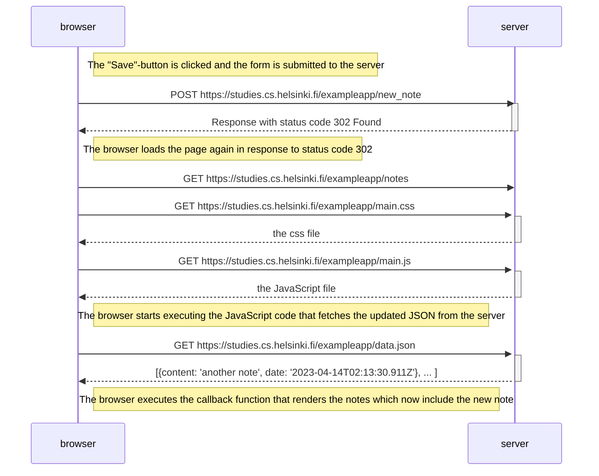

```mermaid
    sequenceDiagram
        participant browser
        participant server

        Note right of browser: The "Save"-button is clicked and the form is submitted to the server

        browser->>server: POST https://studies.cs.helsinki.fi/exampleapp/new_note
        activate server
        server-->>browser: Response with status code 302 Found
        deactivate server

        Note right of browser: The browser loads the page again in response to status code 302

        browser->>server: GET https://studies.cs.helsinki.fi/exampleapp/notes
        activate server

        browser->>server: GET https://studies.cs.helsinki.fi/exampleapp/main.css
        activate server
        server-->>browser: the css file
        deactivate server

        browser->>server: GET https://studies.cs.helsinki.fi/exampleapp/main.js
        activate server
        server-->>browser: the JavaScript file
        deactivate server

        Note right of browser: The browser starts executing the JavaScript code that fetches the updated JSON from the server

        browser->>server: GET https://studies.cs.helsinki.fi/exampleapp/data.json
        activate server
        server-->>browser: [{content: 'another note', date: '2023-04-14T02:13:30.911Z'}, ... ]
        deactivate server

        Note right of browser: The browser executes the callback function that renders the notes which now include the new note
```
