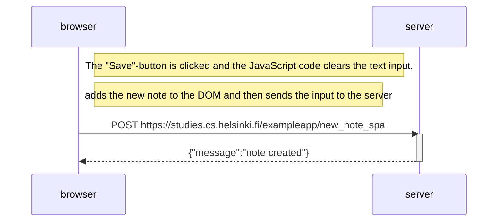

```mermaid
    sequenceDiagram
        participant browser
        participant server

        Note right of browser: The "Save"-button is clicked and the JavaScript code clears the text input,
        Note right of browser: adds the new note to the DOM and then sends the input to the server
        browser->>server: POST https://studies.cs.helsinki.fi/exampleapp/new_note_spa
        activate server
        server-->>browser: {"message":"note created"}
        deactivate server
```
